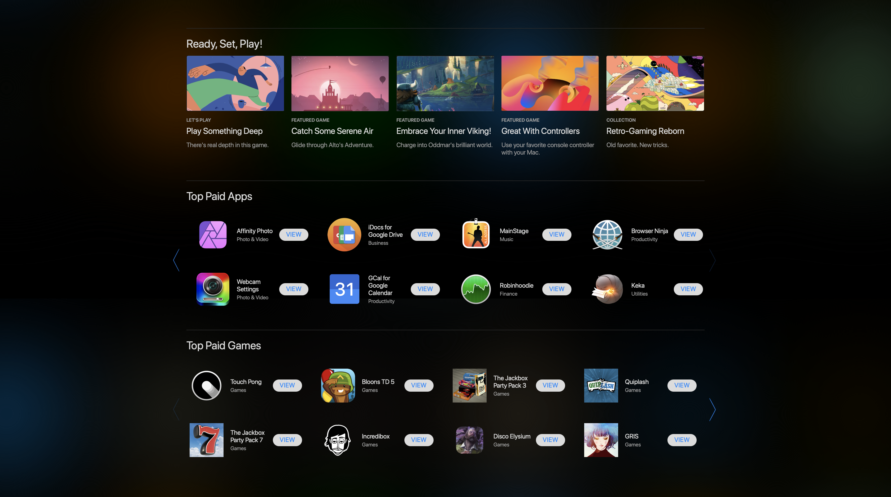

[![MIT License][license-shield]][license-url]
[![LinkedIn][linkedin-shield]][linkedin-url]
 

<h1 align='center' > Mac App Store</h1>

A dynamic website for users to discover and search for macOS apps and music

<h2 style="display: inline-block">Table of Contents</h2>

- [About The Project](#about)
    - [Built With](#built)
- [Logic Design](#logic)
    - [User Authentication](#l1)
    - [Dynamic Webpages](#l2)
    - [API & AJAX](#l3)
    - [Scrolling](#l4)
    - [Local Storage](#l5)
- [Requirements](#req)
- [Getting Started](#start)
- [License](#license)
- [Acknowledgements](#ack)

<h2 id='about'>About The Project</h2>

The Mac App Store website aims to be a hub for users to discover absolutely any app available on the actual Mac App Store and at the same time, serve as a place where they can find songs via a dedicated Apple Music Section. Users can also download their purchased apps (demonstration purposes only) from a dedicated purchased section. The Mac App Store’s minimalistic design coupled with its features such featured, top charts, categories, search, and Apple Music will help users find their next app or song in no time.

<h3 id='built'>Built With</h3>

* [HTML](https://html.com)
* [CSS](https://developer.mozilla.org/en-US/docs/Web/CSS)
* [Javascript](https://www.javascript.com)
* [jQuery](https://jquery.com)
* [PHP](https://www.php.net)
* [iTunes Search API](https://affiliate.itunes.apple.com/resources/documentation/itunes-store-web-service-search-api/)

<h2 id='logic'>Logic Design</h2>
<h3 id='l1'>User Authentication</h3>

<ul>
  <li>PHP is used to store credentials in session cookies after user registers for a new account.</li>
  <li>Bycrypt is used to hash and store the password submitted by the user during registration. When the user wishes to sign in, the stored hash is compared with the new hash to authorize the user.</li>
  <li>Registration page requires a valid looking email address and a strong password in order for the user to successfully create a new account.</li>
  <li>The user is not allowed to go back to the Sign in/Registration Page until the user is logged out. The user is also not allowed to go to any other page except the login/registration page unless the user is signed in.</li>
</ul>
<h3 id='l2'>Dynamic Webpages</h3>

<ul>
  <li><b>Login/Registration:</b> If the user clicks on the “Create One!” link to register a new account, a new registration window will pop up and replace the existing login body. Closing the registration window will make it disappear and show the login window again.
  </li>
  <li>
   <b>Search:</b> Searching for an app on the home page will clear existing content in the body and show the app (if found) with a link to the app’s page. Closing the search window will bring the user back to the previous screen.
  </li>
  <li>
    <b>App Page:</b> Upon clicking on any app on the website, the user will be directed to a dynamic webpage showing the description, screenshots, reviews, etc. of that particular app only.
  </li>
  <li>
     <b>Music Page:</b> This page dynamically changes when the user searches for music. This page also dynamically changes back and forth between itself and the search page according to the user’s actions.
  </li>
  <li><b>Purchases Page:</b> This page dynamically changes back and forth between itself and the search page according to the user’s actions.</li>
</ul>
<h3 id='l3'>API & AJAX</h3>

The iTunes API is accessed using a AJAX method to retrieve data about all apps and songs across the website which is then inserted into HTML code via jQuery.

<h3 id='l4'>Scrolling</h3>

Clicking the left/right buttons in the Home Page will scroll the content left and right. The buttons will also seamlessly fade or reappear according to the content’s position which can be changed by either clicking the left/right button or even initiating a manual horizontal scroll.

<h3 id='l5'>Local Storage</h3>

Information about the app that the user wishes to visit or the apps that the user has purchased is stored in local storage and is used by various pages to retrieve that specific app's data.

<h2 id='req'>Requirements</h2>

* [PHP](http://php.net)

<h2 id='start'>Getting Started</h2>

* Download all files from the repo
* Extract the zip folder to the PHP folder/server
* Open index.html via localhost</li>

<h2 id='license'>License</h2>

Distributed under the MIT License.

<h2 id='ack'>Acknowledgements</h2>

* [Apple Inc.](http://apple.com)

[license-shield]: https://img.shields.io/github/license/othneildrew/Best-README-Template.svg?style=for-the-badge
[license-url]: https://github.com/i0nics/mac-app-store/blob/main/LICENSE
[linkedin-shield]: https://img.shields.io/badge/-LinkedIn-black.svg?style=for-the-badge&logo=linkedin&colorB=555
[linkedin-url]: https://linkedin.com/in/bikramce
